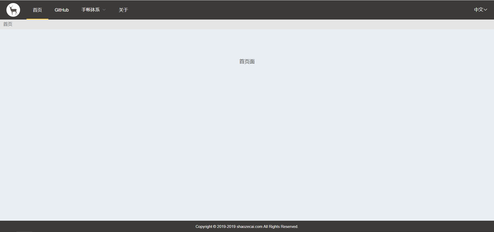

# DNWE
> A web framework based on Vue

## View
 

## Build Setup

``` bash
# install dependencies
npm install

# serve with hot reload at localhost:8080
npm run dev
```

## Tools
- [Vue](https://cn.vuejs.org/) - 渐进式JavaScript 框架。
- [Vuex](https://vuex.vuejs.org/zh/guide/) - 专为 Vue.js 应用程序开发的状态管理模式。
- [Element-ui](https://element.eleme.cn/2.0/#/zh-CN) - 一套为开发者、设计师和产品经理准备的基于 Vue 2.0 的桌面端组件库

## Author
- Email - admin@shaozeci.com
- Web site - https://shaozecai.com

## Version
- v1.0.0